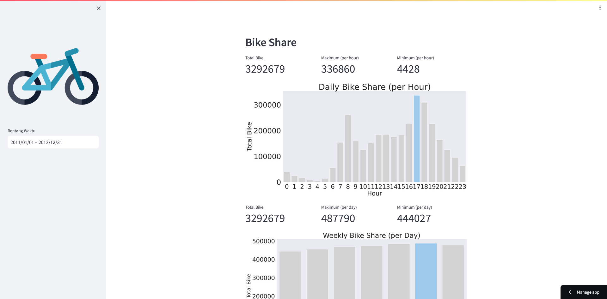

# Proyek Analisis Data: Bike Sharing

Setup environment
```
pip install pipenv
pipenv shell
pipenv run pip install numpy pandas scipy matplotlib seaborn jupyter streamlit babel
```
Run steamlit app
```
streamlit run dashboard/dashboard.py
```

Cloud

Hasil Upload Cloud



Link [Bike Sharing Dashboard Cloud](https://app-dicoding-cmnxxykhvekwuwtunrx7ie.streamlit.app/)